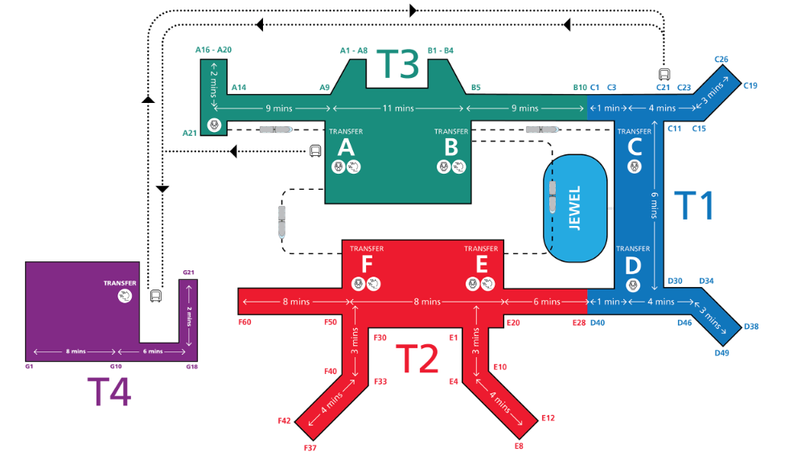

## 准备工作

护照，信用卡，100新币，流量卡，电子入境卡（提前3天）[教程](http://xhslink.com/a/p2avySdwik5db)，电子机票酒店行程单（入境可能会检查）

充电宝，转换头（英标），雨伞（到时候看看下不下雨，要不带着？防晒用）

### 放纸挨抽

注意红绿灯斑马线

地铁上不能吃东西**喝水**

吃完饭要自己回收餐盘（？饭店也需要吗）

### 地铁公交

做公交上车前要招手司机才会停？下车按按钮。上下车各刷一次卡，一张卡只能一个人用。

- **信用卡（这个合适方便）**
  - 手续费每天0.6新币，乘坐次数不限
  - visa或mastercard，需要有无线支付功能（就是卡面带wifi信号图标）
  - 最好在便利店刷一下激活一下信用卡？网上说的，要不坐地铁有可能刷失败

- ezlink公交卡
  - 买卡10新币，卡费和余额各5新币，卡费不退，卡内余额少于3新币就不能坐车了
  - 711或者地铁站可以买

## 行程

### 7月5日

#### 下飞机 ➡ 7、8起床

下飞机后先不入境，境外座多，轻轨在境外也可以往返T123

**T123航站楼的轻轨运行时间是4:30AM - 1:30AM**

比较好的过夜地点有

- 躺椅
  - T1的C16对面
  - T2的E5、E11（OASIS区域）
- T2的E区（等安检的连排沙发）

在T1下，看看那几个T1的躺椅还有没，没有直接去T2有躺椅，沙发还多

#### 起床后 ➡ 10点 

大瀑布大滑梯都是在10点之后才开门，所以这段时间就在境外溜达溜达，吃早饭上厕所，还有热带森林啥的

1. E20附近有[**711**](https://www.changiairport.com/en/at-changi/map.html#t2.l2/103.9902271313/1.3567179198)，早上垫吧一口（顺便刷一下信用卡激活一下吼吼吼）
2. T2的[**Dreamscape（玄梦园）**](https://www.changiairport.com/en/experience/attractions-directory/dreamscape.html)，在2楼的F50附近
3. 坐轻轨到T1
4. T1的[**Tropical Rainforest Vivarium（热带雨林造景缸）**](https://www.changiairport.com/zh/at-changi/map.html#t2.l2/103.98894645/1.3539045216)，在2楼的D40附近
5. T1的[**Discovery Garden（寻密花园）**](https://www.changiairport.com/zh/at-changi/map.html#t1.l2/103.9915995/1.36200075)，在2楼免税店南面，靠近D30
6. T1的[**Water Lily Garden（睡莲花园）**](https://www.changiairport.com/zh/at-changi/map.html#t1.l2/103.98971979/1.36281219)，在2楼免税店北面，靠近C11
7. T1的[**Cactus Garden（仙人掌花园）**](https://www.changiairport.com/zh/at-changi/map.html#t1.l3/103.98910076/1.36305101)，在3楼的免税店北面，睡莲花园楼上
8. T1入境，去[**cheers**](https://www.changiairport.com/en/at-changi/map.html#t1.l2/103.989329525/1.362119665)买个电话卡，要让店员帮忙激活才能收短信
9. 去T2

这几个花园看图片感觉都没我屋大，反正就是熬时间，随便逛逛。**差不多9点半就可以出去了**，还要回T2

#### 10点  ➡ 14点

1. 入境后去坐T2到T3的轻轨（应该就在同层），**一定要靠左坐！！**（T3到T2就是靠右）这里录视频
2. 从T3去Jewel，走步行桥（看[地图](https://www.changiairport.com/zh/at-changi/map.html#t3.l2/103.9872725866735/1.3583287965560515)其实就在轻轨站左边），大约5到10钟
3. 从B2到L5，猛猛拍照
4. L5还有一些别的项目，[WALKING NET（步行网）](https://www.changiairport.com/zh/at-changi/map.html#jewel.l5d/103.98910811/1.36042866)（这个要门票14.3新币，还包含其他项目，[详情](https://www.jewelchangiairport.com/zh/attractions/walking-net.html)），hhh原来这层的项目都要米，到那再看有没有想玩的吧
5. 从Jewel回T2，看看[赛博瀑布（电子屏版）](https://www.changiairport.com/zh/at-changi/map.html#t2.l2/103.98889605260545/1.355143800411376)，在T2的6、7值机柜台附近
6. 再坐一次T2到T3（再看一遍大瀑布吼吼吼）
7. 在T3玩[大滑梯](https://www.changiairport.com/zh/at-changi/map.html#t3.b2/103.98752194/1.35704158)
8. 回Jewel饭饭

##### 大瀑布

- 开业时间：每天早上10:00至晚上10:00（小红书说周一至周四11点开，周五至周日10点开）
- 灯光秀：星期一至星期四：晚上8点、9点；星期五至星期日及公共假日：晚上8点、9点、10点

##### 大滑梯

- 开业时间：周五：17:30 - 22:30；周六、周日、公共假日及学校假期：12:30 - 22:30
- 需要下载樟宜app，注册成会员，填写个人详细信息。最后需要出示会员卡的二维码
- 首先去T3的B2[服务台](https://www.changiairport.com/zh/at-changi/map.html#t3.b2/103.98752194/1.35704158)，出示二维码，会给门票，可以玩十次
- 旁边就有直梯，去L1[入口](https://www.changiairport.com/zh/at-changi/map.html#t3.l1/103.98748251/1.35703334)，就可以玩啦

##### Jewel饭饭（都在B2）

- 松发肉骨茶：两份排骨，一份油条、五香卷和凤爪
- 老曾记：招牌是咖喱饺，炸鸡块也不错，可以一样一份
- Mr.Coconut： 据说人手一杯，招牌椰子冰沙

大滑梯是12点半开业，所以1到6的时间还是很充裕的，有两个半小时，可以慢慢玩。大瀑布控制在一个半点，从赛博瀑布出发控制在12点。

#### 14点  ➡ 16点

1. 该去酒店check in了，大概要一个点。[我是谷歌地图](https://maps.app.goo.gl/pMssBF1JvWVUqroM9)
2. 休息一下吧

#### ~~16点  ➡ 21点~~

1. ~~去滨海湾花园公园，大概要半个小时。[我也是谷歌地图](https://maps.app.goo.gl/5HgLH9vKrL2yXuxi6)~~
2. ~~花穹+云雾林，时间控制在两个半小时，需要订门票~~
3. ~~步行十分钟到擎天树~~
4. ~~[擎天树灯光秀](https://www.gardensbythebay.com.sg/en/things-to-do/calendar-of-events/garden-rhapsody.html)，19点45开始，持续15分钟~~
5. ~~[擎天树北极光秀](https://www.gardensbythebay.com.sg/en/things-to-do/calendar-of-events/borealis.html)，20点开始，持续30分钟~~
6. ~~回酒店哩，半个点~~

#### ~~21点  ➡ 睡觉~~

~~吃饭饭睡觉觉~~

1. ~~去吃咖喱饭，本地人林大哥推荐的，从金沙湾花园去要半个点，走回酒店半个点。[我是谷歌地图](https://maps.app.goo.gl/UWQQvSvV8Uum6y1V9)~~
2. ~~再想想别的~~

### 7月6日

#### 上午 - 9点半多出发

门口是来福士商场，这里有热门早餐店[亚坤](https://maps.app.goo.gl/XC9X7Mf2dKUZjk919)，还有[霸王茶姬](https://maps.app.goo.gl/rjMG9o78RXGbyZoE6)（不过我看这天是十点开门）

1. 来福士吃早饭，亚坤，霸王茶姬
2. 步行5分钟，赞美广场，拍照的
3. 步行7分钟，圣安德烈教堂，拍照的
4. 步行3分钟，新加坡国家美术馆 ，全程大概**一小时**（klook常设展门票69  常设展+特别展134）  
5. 步行8分钟，旧禧街警察局 ，拍照的
6. 步行15分钟，新加坡国家博物馆 ，全程大概**两小时**（klook通票134）
7. 步行5分钟，到树洞，拍照的（不是非得拍，路过看看热闹）
8. 步行15分钟，克拉码头，拍照溜达的
9. 步行5分钟到珍宝海鲜

**上午的路程4公里，1小时，每个景点停留10分钟，一共大概就算2个半小时吧（没算博物馆美术馆）**

#### 中午吃饭

[珍宝海鲜](https://maps.app.goo.gl/wrYpJNxuLsvmxg1J7)，海鲜菜（[注册会员](https://rewards.jumbogroup.sg/register.php)领200-100，[教程](https://www.xiaohongshu.com/explore/682dda8c00000000220358b4?xsec_token=ABVA6JxFBJMuvTHwzS1IvAa077q1Y6TJ0OXAoYW4xYJgc=&xsec_source=pc_user)）

-  🦪【栗蓉带子】🦀️【辣椒蟹】🍤【麦片虾】🥧【炸馒头】🍖【咖啡排骨】
- 微信搜珍宝海鲜预约

买个椰子冰沙下午继续gogogo [位置](https://maps.app.goo.gl/U6CMvC4KMUwQt2sE6)

#### 下午 - 3点半出发

1. 步行15分钟，鱼狮尾公园，拍照的
2. 步行20分钟，螺旋桥，拍照的
3. 步行15分钟，花穹+云雾林，全程大概**两个半小时**（klook门票179）（）
4. 步行5分钟，擎天树
   1. [灯光秀](https://www.gardensbythebay.com.sg/en/things-to-do/calendar-of-events/garden-rhapsody.html)，19点45开始，持续15分钟
   2. [北极光秀](https://www.gardensbythebay.com.sg/en/things-to-do/calendar-of-events/borealis.html)，20点开始，持续30分钟
5. [坐公交](https://maps.app.goo.gl/8xneY97zvvKYt8dK8)回酒店附近

**下午也是4公里，1小时，感觉那个北极光不至于看半个点，提前走省的人多**

#### 晚上吃饭

1. [True Blue](https://maps.app.goo.gl/Bf5wqBC6wKQE54TN8)，娘惹菜，[官网](https://truebluecuisine.com/)（预订、菜单）
2. 来福士商场里有挺多吃的吧，可以到时候看看

### 7月7日

#### 上午 - 10点出发（牛车水）

1. 早餐还没想好，本来想肉骨茶的，但是我感觉你姐他们早上吃不下去哈哈哈哈
2. 地铁16分钟，capitalspring顶楼，风景很好（[预约地址](https://www.sevenrooms.com/experiences/1arden/1-arden-sky-garden-urban-sky-walk-experience-9304739237)，提前14天预约，6月23号早8点30）
3. 步行15分钟，马里安曼兴都庙，印度风格庙，无门票（但是据说印度人多（没有歧视的意思）周一他们还放假，还得脱鞋）
   - 在登婆街向西北看可以看到珍珠坊，这里拍照（没必要去，很老的百货大楼）
4. 步行3分钟，佛牙寺龙华院，中国风格庙，无门票
5. 从后门出来是牛车水大厦，可以拍照（也没必要反正）
6. 步行7分钟，55 Keong Saik Road.，这边建筑风格比较鲜艳
7. 步行6分钟，麦士威美食广场（Maxwell Food Centre）

**路程大概一个小时，全程大概两个半小时（<u>如果昨天的博物馆和美术馆都想去的话，可以把美术馆挪到今天</u>）**

#### 中午吃饭

- 天天海南鸡饭
- 或者我们可以去下一站吃，下一站下地铁后是商场

#### 下午 - 吃完就可以出发了，最晚2点半出发（sentosa）

1. [地铁](https://maps.app.goo.gl/f1xnny92b9L9Rjtv5)21分钟，到港湾站
2. 有一个进岛的轻轨（sentosa express）需要坐到终点站Beach，但是谷歌地图没有，大概10分钟吧
   - 这个轻轨一共有4站：VivoCity、Resorts World、Imbiah、Beach。进岛4新，出岛不要钱
   - 这里也可以走进去，然后在Resorts World坐车。1公里15分钟。（我不是要省4新啊，感觉走进去的风景不错，我不差钱儿）
3. 这里就没什么项目了，可以随便点玩了，看看日落啥的。
   - 一个是skyline luge，像卡丁车。[预约买票地址](https://sentosa.skylineluge.com/zh-hans/book-now-direct/)
   - 还有就是三大海滩了，先到的是Palawan Beach，在中间。另外两个在边上Tanjong Beach、Siloso Beach。岛内有免费巴士。

#### 晚上吃饭

还不知道吃啥，再看看
